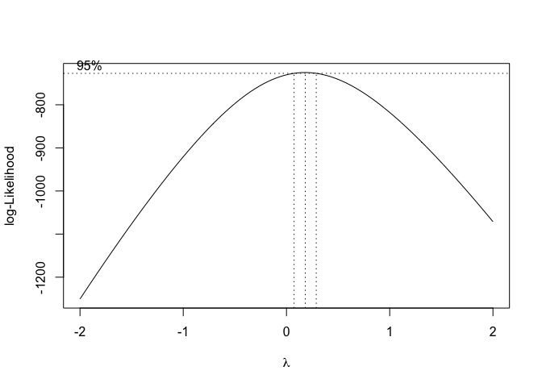
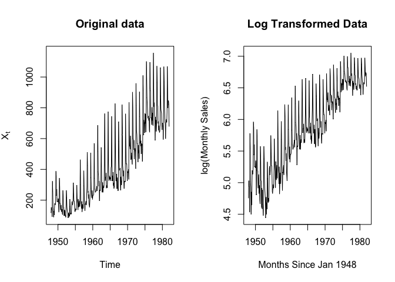

US Female Unemployment Time Series Analysis
================
Becky Su
6/10/19

## Abstract

The purpose of my project is to accurately forecast the unemployment
figures of females aged 16-19 based on previous rates. As the
unemployment rate is dropping, unemployment figures are increasing
exponentially, and we will examine this in my analysis. I will use
RStudio for this time series analysis

In my analysis of this time series, I used various techniques, including
Box-Cox transformations and differencing to remove trend and seasonality
to achieve stationarity, thus allowing me to identify potential models
using ACF and PACF plots. I then performed diagnostic checking on
potential models to identify the best model to use for forecasting.
During my analysis, I was able to come up with various candidate models,
however, only one was most suitable for forecasting:
SARIMA(0,1,3)x(0,1,1)\[12\] model. The SARIMA(0,1,3)x(0,1,1)\[12\] model
passed the Box-Ljung and Box-Pierce tests, possesses the lowest AICc,
and is viable for forecasting compared to our other candidates. It does
not pass the Shapiro-Wilk test for normality of residuals but that can
be attributed to its heavy tailed distribution. Through forecasting I
was able to plot a potential trajectory with 95% confidence for 6 months
in the future. Despite certain validation points being outside the
confidence interval, the forecasted values still remain valid.

## Introduction

My dataset examines the unemployment figures (in thousands) of female
teens of ages 16-19 in the years 1948-1981. The rate of unemployment in
the US will always be a topic of relevance because of its steady
decline. As of September 2018, the women’s unemployment rate dropped to
3.6%, matching the lowest level since 1953. The labor force
participation for all teens in 1948 started at 52.8% and trended down to
44.5% in 1964. Until several recessions starting in 1979, the proportion
of teens in the labor force was increasing. In this time series
analysis, I want to accurately forecast the unemployment figures of
female teens of ages 16-19 in the next 6 months after December 1981 and
I expect that it will follow an increasing trend.

I sourced this data from the Time Series Data Library (TSDL) created by
Rob Hyndman. I queried the dataset according to length, subject, and
description and used the 18th dataset, “Monthly U.S. female (16-19
years) unemployment figures (thousands) 1948-1981”.

Upon initial observation of this data, I noticed a strong linear trend
and seasonality of 12, since this is monthly data. To achieve
stationarity in the data for model selection, I first applied Box-Cox
transformation to stabilize the variance for differencing. I differenced
at lag 12 to remove seasonality and then again at lag 1 to remove any
remaining trend component. Ater removing trend and seasonality, I was
able to examine ACF and PACF to examine candidate best fit models. I
tested the fit of 3 models,
(0,1,1)_{12}"),
(0,1,2)_{12}"),
and
(5,1,1)_{12}")
and compared their AICc values and parsimony. Because the second model
equates to the first and the third model lost all it’s seasonal terms
after we eliminated insignificant coefficients, we only use
(0,1,1)_{12}")
for diagnostic checking. For diagnostic checking, I utilized techniques
such as Shapiro-Wilk test (normality of residuals), Box-Pierce/Ljung
tests (serial correlation of residuals/lack of fit of time series
model), ACF, Q-Q plot, and histogram, to obtain the best model based on
these criteria. I used this best model to forecast and make predictions.

After diagnostic checking, I found that my best model was
(0,1,1)_{12}"),
after removing one MA term from
(0,1,1)_{12}").
Though it passed Box-Pierce/Ljung tests, held the lowest AICc, it did
not pass the Shapiro-Wilk normality test and I attribute this to the
dataset having many large outliers and thus being a heavy-tailed
distribution.

My final model was
(0,1,1)_{12}"),
with MA(2) and SMA(1) differenced once for both seasonality and trend. I
validated and forecasted unemployment figures for the next 6 months
using this model.

## Dataset Information

    ## [1] 408

    ## [1] "Labour market"

    ## [1] "Andrews & Herzberg (1985)"

    ## [1] "Monthly U.S. female (16-19 years) unemployment figures (thousands) 1948-1981"

## Initial Time Series Analysis

To start, we plotted the time series of the original data to get an idea
of its general form and to identify whether any trend or seasonality is
present.

<!-- -->
We can see a strong exponential trend from the positive exponential
increase of the graph. In addition, there is also a strong seasonal
component within every year.

<!-- --><!-- -->

The ACF and PACF plots validate our assumptions that the series is not
stationary and has a strong trend and seasonality component. We conclude
this by looking at the ACF which declines very slowly indicating strong
trend and the peaks which occur every 12 lags indicating a seasonality
of 12.

<!-- -->

We use the decompose function to visualize the different components of
the model, such as trend, seasonality, and stationarity.

## Box-Cox Transformation

Box Cox transformations can help us deal with the problem of
heteroscedasticity in our data. However, we must plot a 95% confidence
interval to see what value of

can maximize our log-likelihood.

<!-- -->

    ## [1] 0.1818182

<!-- --><!-- -->

Since the box-cox confidence interval does not include

= 0 or

= 1, we must transform the data and the Box-Cox transformation for
stabilizing the variance is given
by:").
There is a strong linear trend in either of the transformed series
(e.g. Box-Cox). Therefore, in order to remove the trend component it is
enough to difference the data at lag 1.

``` r
#variance of original data compared to boxcox transformed
var(femp.ts)
```

    ## [1] 63939.23

``` r
var(femp.bc)
```

    ## [1] 3.489648

The variance of the boxcox transformed data is 3.489648.

<!-- -->

Notice the cyclical behaviour in the ACF of the transformed data. Also,
notice that there are significant correlations with values moving
proportionally every 12 lags. Therefore, we can see that the period of
the seasonal component is given by d = 12.

## Removing Trend and Seasonality

We first difference at lag 12 to remove the seasonality and some trend
in the time series.

<!-- -->

<!-- -->

    ## [1] 3.489648

    ## [1] 0.3090706

We difference again at lag 1 to remove trend.

<!-- -->

<!-- -->

    ## [1] 63939.23

    ## [1] 0.3090706

    ## [1] 0.2178664

After differencing at lag 12 to remove seasonality, there is still
sigfinicant trend component. The variance decreased from 3.4896 to
0.30907. We then difference again at lag 1 to remove trend. This further
decreases the variance: 0.2178664. We can see that the linear trend and
seasonality are removed. The mean is also constant.

A spike at 12 in the ACF is significant but no other is significant at
lags multiple of 12, the PACF shows an exponential decay in the seasonal
lags; that is 12, 24, 36 etc. Thus, the seasonal part of the model has a
moving average term of order 1 and an autoregressive term of 5. We can
also consider significance at lag 24 in the ACF, indicative of a
seasonal moving average term of order 2. For the non-seasonal part, the
ACF at lag 1 is negative, indicative of an MA model and the PACF cuts
off after lag 3. Therefore, the non-seasonal part has a moving average
term of 3.

Possible models:  
Seasonal component  
(i) SMA(1) –ACF cuts off after lag 1 and PACF tails off, P=0, Q=1  
(ii) SMA(2) –ACF cuts off after lag 2 and PAC tails off, P=0, Q=2  
(iii) SARMA(5,1) –ACF and PACF tailing off in seasonal lag, P=5, Q=1  
Nonseasonal elements  
(i) MA(3)  
—  
Possible Models:  
(1) SARIMA(0,1,3)x(0,1,1)\[12\]  
(2) SARIMA(0,1,3)x(0,1,3)\[12\]  
(3) SARIMA(0,1,3)x(5,1,1)\[12\]

## Model Selection

### SARIMA(0,1,3)x(0,1,1)\[12\]

    ## Loading required package: minpack.lm

    ## Loading required package: rgl

    ## Warning in rgl.init(initValue, onlyNULL): RGL: unable to open X11 display

    ## Warning: 'rgl.init' failed, running with 'rgl.useNULL = TRUE'.

    ## Loading required package: robustbase

    ## Loading required package: Matrix

    ## 
    ## Call:
    ## arima(x = femp.ts, order = c(0, 1, 3), seasonal = list(order = c(0, 1, 1), period = 12), 
    ##     method = "ML")
    ## 
    ## Coefficients:
    ##           ma1      ma2      ma3     sma1
    ##       -0.4879  -0.0595  -0.1219  -0.5918
    ## s.e.   0.0513   0.0519   0.0543   0.0412
    ## 
    ## sigma^2 estimated as 1887:  log likelihood = -2053.07,  aic = 4116.13

    ## [1] 4116.231

    ##           2.5 %      97.5 %
    ## ma1  -0.5884350 -0.38736969
    ## ma2  -0.1613164  0.04230138
    ## ma3  -0.2283415 -0.01537551
    ## sma1 -0.6725851 -0.51094917

    ## 
    ## Call:
    ## arima(x = femp.bc, order = c(0, 1, 3), seasonal = list(order = c(0, 1, 1), period = 12), 
    ##     fixed = c(NA, 0, NA, NA), method = "ML")
    ## 
    ## Coefficients:
    ##           ma1  ma2      ma3     sma1
    ##       -0.4809    0  -0.0937  -0.6889
    ## s.e.   0.0474    0   0.0520   0.0434
    ## 
    ## sigma^2 estimated as 0.1277:  log likelihood = -157.99,  aic = 323.98

    ## [1] 324.0744

After taking confidence interval of the coefficients, we find that the
CI for ma2 contains 0, so it is not significant. However, the terms ma1,
ma3, and sma1 are all significant. The AICc is 4116.231. We fit the
modified model with one less term and get an AICC of 324.0744. Our
modified model is
(0,1,1)_{12}").

### SARIMA(0,1,3)x(0,1,2)\[12\]

    ## 
    ## Call:
    ## arima(x = femp.ts, order = c(0, 1, 3), seasonal = list(order = c(0, 1, 2), period = 12), 
    ##     method = "ML")
    ## 
    ## Coefficients:
    ##           ma1      ma2      ma3     sma1    sma2
    ##       -0.4893  -0.0588  -0.1206  -0.5968  0.0082
    ## s.e.   0.0521   0.0522   0.0550   0.0536  0.0552
    ## 
    ## sigma^2 estimated as 1887:  log likelihood = -2053.05,  aic = 4118.11

    ## [1] 4118.259

    ##            2.5 %      97.5 %
    ## ma1  -0.59137187 -0.38720193
    ## ma2  -0.16106488  0.04336983
    ## ma3  -0.22828264 -0.01287578
    ## sma1 -0.70178483 -0.49185777
    ## sma2 -0.09984963  0.11634334

    ## 
    ## Call:
    ## arima(x = femp.bc, order = c(0, 1, 3), seasonal = list(order = c(0, 1, 2), period = 12), 
    ##     fixed = c(NA, 0, NA, NA, 0), method = "ML")
    ## 
    ## Coefficients:
    ##           ma1  ma2      ma3     sma1  sma2
    ##       -0.4809    0  -0.0937  -0.6889     0
    ## s.e.   0.0474    0   0.0520   0.0434     0
    ## 
    ## sigma^2 estimated as 0.1277:  log likelihood = -157.99,  aic = 323.98

    ## [1] 324.1244

After taking confidence interval of the coefficients, we find that the
CI for ma2 and sma2 contain 0, so they are not significant. However, the
terms ma1, ma3, and sma1 are all significant. The AICc is 4118.259. We
fit the modified model with two less terms and get an AICC of 324.1244.
The modified model is
(0,1,1)_{12}")
which becomes the same as our first model.

### SARIMA(0,1,3)x(5,1,1)\[12\]

    ## 
    ## Call:
    ## arima(x = femp.ts, order = c(0, 1, 3), seasonal = list(order = c(5, 1, 1), period = 12), 
    ##     method = "ML")
    ## 
    ## Coefficients:
    ##           ma1      ma2      ma3     sar1     sar2     sar3     sar4    sar5
    ##       -0.4791  -0.0613  -0.1356  -0.2596  -0.1852  -0.0609  -0.0338  0.0736
    ## s.e.   0.0528   0.0518   0.0566   1.3690   0.8170   0.5336   0.2775  0.1607
    ##          sma1
    ##       -0.3349
    ## s.e.   1.3724
    ## 
    ## sigma^2 estimated as 1865:  log likelihood = -2050.97,  aic = 4121.93

    ## [1] 4122.383

    ##           2.5 %      97.5 %
    ## ma1  -0.5825902 -0.37554849
    ## ma2  -0.1628131  0.04021851
    ## ma3  -0.2466182 -0.02462234
    ## sar1 -2.9427894  2.42353007
    ## sar2 -1.7864233  1.41601608
    ## sar3 -1.1066484  0.98493722
    ## sar4 -0.5776258  0.51002259
    ## sar5 -0.2412767  0.38855886
    ## sma1 -3.0247061  2.35487151

    ## Warning in arima(femp.bc, order = c(0, 1, 3), seasonal = list(order = c(5, :
    ## some AR parameters were fixed: setting transform.pars = FALSE

    ## 
    ## Call:
    ## arima(x = femp.bc, order = c(0, 1, 3), seasonal = list(order = c(5, 1, 1), period = 12), 
    ##     fixed = c(NA, 0, NA, 0, 0, 0, 0, 0, 0), method = "ML")
    ## 
    ## Coefficients:
    ##           ma1  ma2      ma3  sar1  sar2  sar3  sar4  sar5  sma1
    ##       -0.4363    0  -0.0627     0     0     0     0     0     0
    ## s.e.   0.0464    0   0.0535     0     0     0     0     0     0
    ## 
    ## sigma^2 estimated as 0.1812:  log likelihood = -223.29,  aic = 452.58

    ## [1] 453.0286

After taking confidence interval of the coefficients, we find that only
the coefficients ma1 and ma3 are significant. The AICc is 4122.383. We
fit the modified model and get an AICC of 453.0286. The modified model
then becomes
(0,1,0)_{12}").
I will not proceed with diagnostic checking with this model because
there are no significant seasonal terms.

Our best model using the AICc criteria and parsimony is model 1,
(0,1,1)_{12}").

## Diagnostic Checking on Test Models

### SARIMA(0,1,2)x(0,1,1)\[12\]

    ## initial  value 4.035466 
    ## iter   2 value 3.830374
    ## iter   3 value 3.799595
    ## iter   4 value 3.789628
    ## iter   5 value 3.783074
    ## iter   6 value 3.782366
    ## iter   7 value 3.782292
    ## iter   8 value 3.782275
    ## iter   9 value 3.782275
    ## iter   9 value 3.782275
    ## iter   9 value 3.782275
    ## final  value 3.782275 
    ## converged
    ## initial  value 3.785056 
    ## iter   2 value 3.785043
    ## iter   3 value 3.785040
    ## iter   3 value 3.785040
    ## iter   3 value 3.785040
    ## final  value 3.785040 
    ## converged

<!-- -->

    ## $fit
    ## 
    ## Call:
    ## arima(x = xdata, order = c(p, d, q), seasonal = list(order = c(P, D, Q), period = S), 
    ##     include.mean = !no.constant, transform.pars = trans, fixed = fixed, optim.control = list(trace = trc, 
    ##         REPORT = 1, reltol = tol))
    ## 
    ## Coefficients:
    ##           ma1      ma2     sma1
    ##       -0.5132  -0.0964  -0.5897
    ## s.e.   0.0479   0.0481   0.0410
    ## 
    ## sigma^2 estimated as 1912:  log likelihood = -2055.57,  aic = 4119.14
    ## 
    ## $degrees_of_freedom
    ## [1] 392
    ## 
    ## $ttable
    ##      Estimate     SE  t.value p.value
    ## ma1   -0.5132 0.0479 -10.7135  0.0000
    ## ma2   -0.0964 0.0481  -2.0033  0.0458
    ## sma1  -0.5897 0.0410 -14.3890  0.0000
    ## 
    ## $AIC
    ## [1] 10.42821
    ## 
    ## $AICc
    ## [1] 10.42837
    ## 
    ## $BIC
    ## [1] 10.4685

    ## 
    ##  Box-Ljung test
    ## 
    ## data:  residuals(fit1)
    ## X-squared = 0.26568, df = 1, p-value = 0.6062

    ## 
    ##  Box-Pierce test
    ## 
    ## data:  residuals(fit1)
    ## X-squared = 0.26373, df = 1, p-value = 0.6076

    ## 
    ##  Shapiro-Wilk normality test
    ## 
    ## data:  residuals(fit1)
    ## W = 0.99114, p-value = 0.01511

<!-- --><!-- -->

The p-values for the Box-Ljung and Box-Pierce test are greater than the
significance level of 0.05, so this model passes both tests. However, my
best model doesn’t satisfy the normality condition. Sample I only
perform diagnostic checking on this model because after testing the
significance of coefficient in my other 2 models in the previous step,
model 2 equates to model 1, and my last model loses all its seasonal
terms, which is not indicative of this dataset. After diagnostic
checking, we still choose model 1,
(0,1,1)_{12}"),
even though it’s residuals do not satisfy the normality condition. This
can be attributed to the fact that the data has a heavy tailed
distribution and the data has large values with many outliers. This also
explains its large variance of 63939.23.

``` r
#Fit to AR(0)
ar(residuals(fit1), aic = TRUE, order.max = NULL, method = c("yule-walker"))
```

    ## 
    ## Call:
    ## ar(x = residuals(fit1), aic = TRUE, order.max = NULL, method = c("yule-walker"))
    ## 
    ## 
    ## Order selected 0  sigma^2 estimated as  0.1239

``` r
tsdiag(arima(residuals(fit1), order=c(0,0,0)))
```

<!-- -->
Fitted residuals to AR(0)

## Checking Causality and Invertibility for SARIMA(0,1,2)x(0,1,1)\[12\]

<!-- --><!-- -->

All roots are outside unit circle, hence the model is causal and
invertible. This means that this process has a representation in terms
of the white noise and is uncorrelated with future observations. In
addition, this means that the noises can be inverted into a
representation of past observations, innovations in the past can be
estimated and we can use this model for forecasting. This model is ready
to be used for forecasting.

## Forecasting

    ## $pred
    ## Time Series:
    ## Start = 404 
    ## End = 414 
    ## Frequency = 1 
    ##  [1]  821.2524  793.8605  739.4508  717.5135  643.7551  722.9150  714.6766
    ##  [8]  717.8241  674.0795  755.5504 1087.3992
    ## 
    ## $se
    ## Time Series:
    ## Start = 404 
    ## End = 414 
    ## Frequency = 1 
    ##  [1] 43.56533 48.32792 51.27984 54.07085 56.72469 59.25981 61.69084 64.02963
    ##  [9] 66.28596 68.46797 70.58255

<!-- -->

We removed the last 5 observed values and predicted 11 points, which
gives us predictions for 6 months after our last observed point. The
observed value is shown as the blue circles and our prediction is shown
as the red circles. The gray shaded area gives the 95% confidence
interval of our predictions. The confidence interval of our predictions
does not include the third point from the original data.

## Conclusion

My goal for this project was to predict the unemployment figures of
females age 16-19 for the next year after 1981. I forecasted the
unemployment rate using the model
(0,1,1)_{12}").
This is a viable model because none of my prediction intervals contain
0. Though not all of my validation points lie within the 95% CI, the
majority of them are and, furthermore,the validation points converge
towards our predictions as time goes on. Looking at the original time
series, we can perhaps explain the 406th data point not lying within the
95% condifidence interval with the seasonality, since the trend
oscillates between the months of every year. However, with time, we can
see that our predictions are indeed valid and accurate, as our
prediction for December 1981 and our validation point are nearly the
same. In conclusion, we can expect the unemployment figures to continue
to fluctuate drastically between the months of every year but the rate
of fluctuation will remain stagnant as it has since 1978. I’ve
accomplished my goal of understanding the future unemployment rates of
US female teens of ages 16-19, arriving at my final model of
(0,1,1)_{12}").
Model:


## References

Monthly U.S. female (16-19 years) unemployment figures (thousands)
1948-1981, data available on Prof. Rob Hyndmans, Time Series Data
Library (TSDL), accessed in RStudio.

## Appendix

``` r
library(tsdl)
```

``` r
library(MASS)
#data attributes
k=18
femp.ts <- tsdl[[k]]
length(femp.ts)
attr(femp.ts, "subject")
attr(femp.ts, "source")
attr(femp.ts, "description")
```

``` r
#time series plot of original data
ts.plot(femp.ts, col="blue",xlab="Years From 1948-1981", ylab="Unemployment Figures (thousands)",
        main="Monthly US Female (16-19 Years) Unemployment Figures from 1948-1981")
```

``` r
#ACF and PACF of original time series data
acf(femp.ts, lag.max = 100, main = "Xt")
pacf(femp.ts, lag.max = 100, main = "Xt")
```

``` r
#Multiplicative decomposition to examine trend and seasonality
plot(decompose(femp.ts))
```

``` r
#Box-Cox Transformation
library(MASS)
t = 1:length(femp.ts)
fit = lm(femp.ts ~ t)
bcTransform = boxcox(femp.ts ~ t,plotit = TRUE)
lambda = bcTransform$x[which(bcTransform$y == max(bcTransform$y))]
lambda
femp.bc = (1/lambda)*(femp.ts^lambda-1)
op <- par(mfrow = c(1,2))
#plot box-cox transformation
ts.plot(femp.ts,main = "Original data",ylab = expression(X[t]))
ts.plot(femp.bc,main = "Box-Cox transformed data", ylab = expression(Y[t]))
#log transformation
femp.tr <- log(femp.ts)
femp.log <- femp.ts^(1/3)
#plot log transformation
ts.plot(femp.ts,main = "Original data", ylab = expression(X[t]))
ts.plot(femp.tr, xlab = "Months Since Jan 1948", ylab = "log(Monthly Sales)", 
        main = "Log Transformed Data")
```

``` r
#variance of original data compared to boxcox transformed
var(femp.ts)
var(femp.bc)
```

``` r
#ACF/PACF of boxcox transformed data
op = par(mfrow = c(1,2))
acf(femp.bc,lag.max = 60,main = "")
pacf(femp.bc,lag.max = 60,main = "")
title("Box-Cox Transformed Time Series", line = -1, outer=TRUE)
```

``` r
# Difference at lag = 12 (cycle determined by the ACF) to remove seasonal component
y1 = diff(femp.bc, 12)
ts.plot(y1,main = "De-seasonalized Time Series",ylab = expression(nabla^{12}~nabla~Y[t]))
abline(h = 0,lty = 2)
```

``` r
#Differenced seasonality   
op = par(mfrow = c(1,2))
acf(y1,lag.max = 60,main = "")
pacf(y1,lag.max = 60,main = "")
title("De-seasonalized Time Series", line = -1, outer=TRUE)
```

``` r
#Variance of boxcox transformed data compared to variance of data differenced at lag 12
var(femp.ts)
var(y1)
```

``` r
#differenced once to remove trend
y2 = diff(y1, 1)
ts.plot(y2,main = "De-trended/seasonalized Time Series",ylab = expression(nabla^{1}~nabla~Y[t]))
abline(h = 0,lty = 2)
abline(h=mean(y2), col="red")
```

``` r
#Differenced once acf/pacf 
op = par(mfrow = c(1,2))
acf(y2,lag.max = 100,main = "")
pacf(y2,lag.max = 100,main = "")
title("De-trended Time Series", line = -1, outer=TRUE)
```

``` r
#Variance of original time series compared to deseasonalized variance and detrended variance
var(femp.ts)
var(y1)
var(y2)
```

## Model Selection

### SARIMA(0,1,3)x(0,1,1)\[12\]

``` r
library(qpcR)
mod1 <- arima(femp.ts, order = c(0, 1, 3), seasonal = list(order = c(0, 1, 1), 
period = 12), method="ML")
mod1
AICc(mod1)
#confidence interval
confint(mod1, level=0.95)
#new fit
fit1 <- arima(femp.bc, order = c(0, 1, 3), seasonal = list(order = c(0, 1, 1), 
period = 12), fixed=c(NA,0,NA,NA), method="ML")
fit1
#new AICc
AICc(fit1)
```

### SARIMA(0,1,3)x(0,1,2)\[12\]

``` r
mod2 <- arima(femp.ts, order = c(0, 1, 3), seasonal = list(order = c(0, 1, 2), 
period = 12), method="ML")
mod2
AICc(mod2)
#confidence interval
confint(mod2, level=0.95)
#new fit
fit2 <- arima(femp.bc, order = c(0, 1, 3), seasonal = list(order = c(0, 1, 2), 
period = 12), fixed=c(NA,0,NA,NA,0), method="ML")
fit2
#new AICc
AICc(fit2)
```

### SARIMA(0,1,3)x(5,1,1)\[12\]

``` r
mod3 <- arima(femp.ts, order = c(0, 1, 3), seasonal = list(order = c(5, 1, 1), 
period = 12), method="ML")
mod3
AICc(mod3)
#confidence interval
confint(mod3, level=0.95) #all sig
#new fit
fit3 <- arima(femp.bc, order = c(0, 1, 3), seasonal = list(order = c(5, 1, 1), period = 12), fixed=c(NA,0,NA,0,0,0,0,0,0), method="ML")
fit3
#new AICc
AICc(fit3)
```

## Diagnostic Checking on Test Models

### SARIMA(0,1,2)x(0,1,1)\[12\]

``` r
library("astsa")
fit1 <- arima(femp.bc, order = c(0, 1, 3), seasonal = list(order = c(0, 1, 1), period = 12), fixed=c(NA,0,NA,NA), method="ML")
#Standardized residual plot, ACF, Q-Q plot, p-values for Ljung-Box
sarima(femp.ts,0,1,2,0,1,1,12)
#test for independence of residuals
Box.test(residuals(fit1), type="Ljung")
#test for
Box.test(residuals(fit1), type ="Box-Pierce")
#test for normality of residuals
shapiro.test(residuals(fit1))
#plot fitted residuals
op <- par(mfrow=c(2,2))
ts.plot(residuals(fit1),main = "Fitted Residuals SARIMA(0,1,2)x(0,1,1)[12]")
par(mfrow=c(1,2),oma=c(0,0,2,0))
#Histogram
hist(residuals(fit1),main = "SARIMA(0,1,2)x(0,1,1)[12] Residuals")
```

``` r
#Fit to AR(0)
ar(residuals(fit1), aic = TRUE, order.max = NULL, method = c("yule-walker"))
tsdiag(arima(residuals(fit1), order=c(0,0,0)))
```

## Checking Causality and Invertibility for SARIMA(0,1,2)x(0,1,1)\[12\]

``` r
plot.roots <- function(ar.roots=NULL, ma.roots=NULL, size=2, angles=FALSE, special=NULL, sqecial=NULL,my.pch=1,first.col="blue",second.col="red",main=NULL)
{xylims <- c(-size,size)
      omegas <- seq(0,2*pi,pi/500)
      temp <- exp(complex(real=rep(0,length(omegas)),imag=omegas))
      plot(Re(temp),Im(temp),typ="l",xlab="x",ylab="y",xlim=xylims,ylim=xylims,main=main)
      abline(v=0,lty="dotted")
      abline(h=0,lty="dotted")
      if(!is.null(ar.roots))
        {
          points(Re(1/ar.roots),Im(1/ar.roots),col=first.col,pch=my.pch)
          points(Re(ar.roots),Im(ar.roots),col=second.col,pch=my.pch)
        }
      if(!is.null(ma.roots))
        {
          points(Re(1/ma.roots),Im(1/ma.roots),pch="*",cex=1.5,col=first.col)
          points(Re(ma.roots),Im(ma.roots),pch="*",cex=1.5,col=second.col)
        }
      if(angles)
        {
          if(!is.null(ar.roots))
            {
              abline(a=0,b=Im(ar.roots[1])/Re(ar.roots[1]),lty="dotted")
              abline(a=0,b=Im(ar.roots[2])/Re(ar.roots[2]),lty="dotted")
            }
          if(!is.null(ma.roots))
            {
              sapply(1:length(ma.roots), function(j) abline(a=0,b=Im(ma.roots[j])/Re(ma.roots[j]),lty="dotted"))
            }
        }
      if(!is.null(special))
        {
          lines(Re(special),Im(special),lwd=2)
        }
      if(!is.null(special))
        {
          lines(Re(special),Im(special),lwd=2)
        }
}
#Check causality and invertibility
plot.roots(NULL,polyroot(c(1, -0.4809, -0.0937)), main="roots of ma part")
plot.roots(NULL,polyroot(c(1, -0.6889)), main="roots of sma part")
```

## Forecasting

``` r
##We will forecast the next 11 observations of the original data. We expect to see 
##its confidence interval include the removed values 799 832 846 824 678.
#remove last 5 observations out of 408
newfemp <- femp.ts[1:403]
#select the last 5 observations
rfemp <- femp.ts[404:408]
#plot observations on forecast data
femp.test=ts(rfemp, start = c(404,1))
#forecast/prediction for next 11 observations
sarima.for(newfemp, 11,0,1,2,0,1,1,12)
points(femp.test, col="blue")
```
